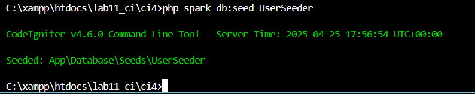
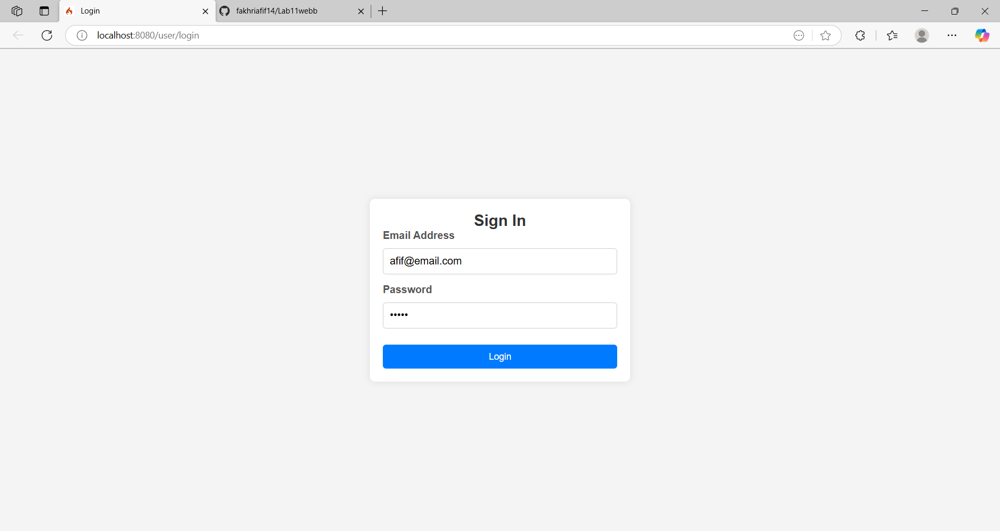
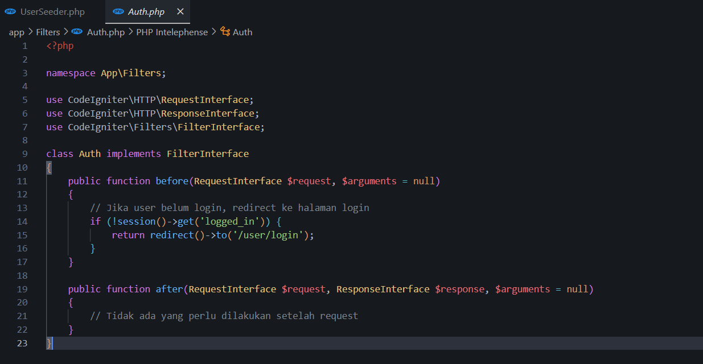
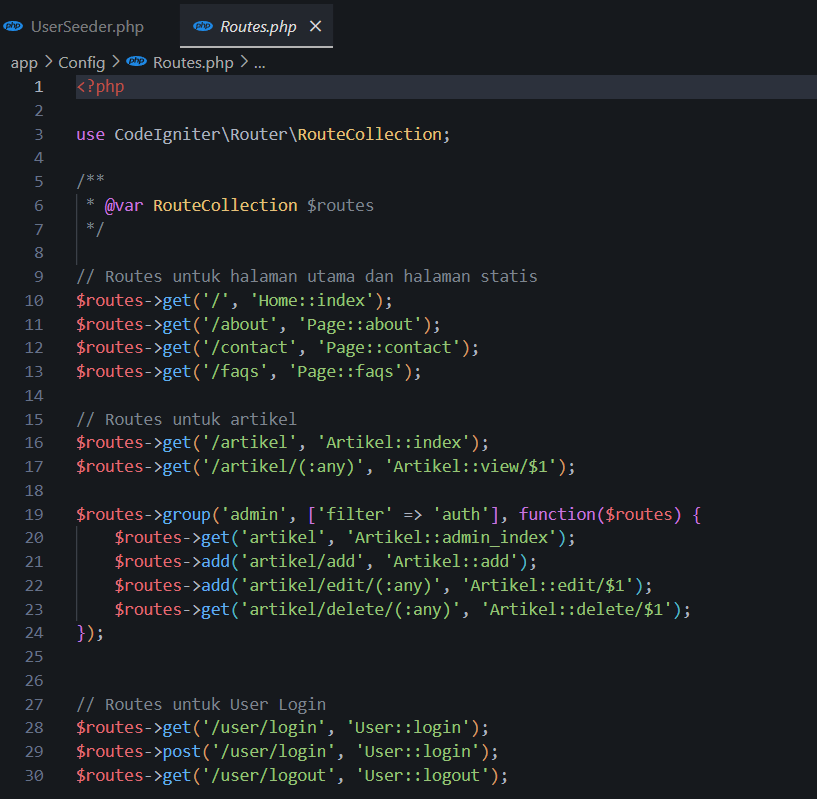

# PHP Framework (Codeigniter4)
| Praktikum 4-6  |  Pemrograman Web 2  
|-------|---------
| NIM   | 312310632
| Nama  | fakhri afif
| Kelas | TI.23.A6
| Dosen |  Agung Nugroho, S.Kom., M.Kom.


## Praktikum 4
### Langkah-langkah Praktikum
- Membuat Table User
```
CREATE TABLE user (
 id INT(11) auto_increment,
 username VARCHAR(200) NOT NULL,
 useremail VARCHAR(200),
 userpassword VARCHAR(200),
 PRIMARY KEY(id)
);
```
- Membuat Model User

Oke, aku buatin yang lebih **rapi**, **terstruktur**, dan cocok banget buat ditaruh di `README.md` GitHub! Ini aku kasih yang clean, konsisten, dan nyaman dibaca:

---

# 📚 Praktikum: Database Seeder, Auth Filter, dan Pagination

## 📌 1. Membuat Database Seeder

Seeder digunakan untuk mengisi database dengan data dummy, misalnya untuk keperluan pengujian login.

### Langkah-langkah:

1. **Buka CLI** dan jalankan perintah berikut:

   

2. **Buka file** `app/Database/Seeds/UserSeeder.php` dan isi dengan kode berikut:

   

3. **Kembali ke CLI** dan jalankan perintah berikut untuk menjalankan seeder:

   

---

## 📌 2. Uji Coba Login

Setelah database terisi, lakukan pengujian login.

- Buka URL: [http://localhost:8080/user/login](http://localhost:8080/user/login)

Tampilan login:



---

## 📌 3. Menambahkan Auth Filter

Untuk melindungi halaman admin, kita perlu membuat filter autentikasi.

### Langkah-langkah:

1. **Buat file** `Auth.php` di direktori `app/Filters/`.

   

2. **Daftarkan filter** baru di `app/Config/Filters.php`:

   ```php
   'auth' => App\Filters\Auth::class,
   ```

   

3. **Atur routes** untuk halaman yang ingin dilindungi, di `app/Config/Routes.php`:

   

---

## 📌 4. Percobaan Akses Menu Admin

- Cobalah akses URL: [http://localhost:8080/admin/artikel](http://localhost:8080/admin/artikel)

Jika belum login, pengguna akan otomatis diarahkan ke halaman login.

Tampilan:


---

## 📌 5. Praktikum 5: Membuat Pagination

Pagination berguna untuk membatasi tampilan data dalam jumlah besar menjadi beberapa halaman kecil.

### Langkah-langkah:

1. **Modifikasi method** `admin_index` di `App/Controller/Artikel`:

   

2. **Tambahkan form pencarian** di `App/Views/artikel/admin_index.php`, sebelum tabel:

   

3. **Ubah tampilan link pagination** di bawah tabel:

   

---


