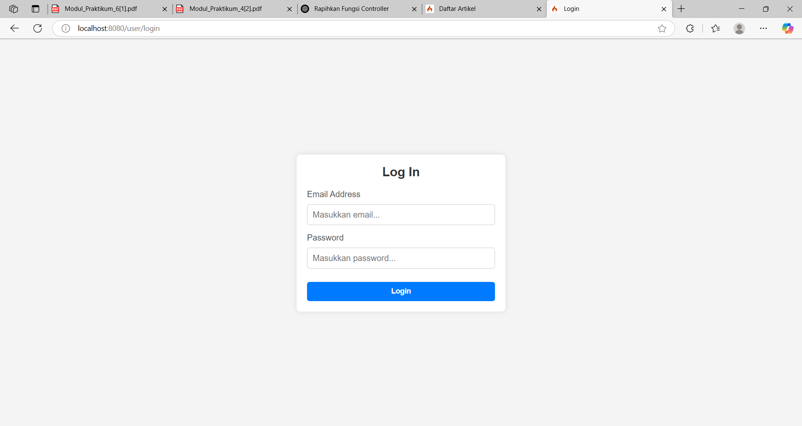

# 📘 PHP Framework (CodeIgniter 4) – Praktikum 4–6

**Mata Kuliah:** Pemrograman Web 2

| Field     | Data                          |
| --------- | ----------------------------- |
| **NIM**   | 312310632                     |
| **Nama**  | Fakhri Afif                   |
| **Kelas** | TI.23.A6                      |
| **Dosen** | Agung Nugroho, S.Kom., M.Kom. |

---

## ✅ Praktikum 4 – Database Seeder & Auth Filter

### 🔹 Membuat Tabel `user`

```sql
CREATE TABLE user (
 id INT(11) auto_increment,
 username VARCHAR(200) NOT NULL,
 useremail VARCHAR(200),
 userpassword VARCHAR(200),
 PRIMARY KEY(id)
);
```

### 🔹 Membuat Model `User`


### 🔹 Seeder untuk Data Dummy Login

1. **Jalankan CLI**:
   

2. **Edit file** `app/Database/Seeds/UserSeeder.php`:
   

3. **Jalankan Seeder**:
   

---

### 🔹 Uji Coba Login

* Akses: [http://localhost:8080/user/login](http://localhost:8080/user/login)
* Tampilan:
  

---

### 🔹 Menambahkan Auth Filter

1. Buat file `Auth.php` di `app/Filters/`
   

2. Daftarkan filter di `app/Config/Filters.php`:

   ```php
   'auth' => App\Filters\Auth::class,
   ```

   

3. Atur route yang ingin dilindungi di `app/Config/Routes.php`
   

---

### 🔹 Pengujian Akses Admin (Tanpa Login)

* Akses: [http://localhost:8080/admin/artikel](http://localhost:8080/admin/artikel)
* Redirect ke login jika belum autentikasi:
  

---

## ✅ Praktikum 5 – Pagination & Pencarian Artikel

### 🔹 Menambahkan Pagination

1. Modifikasi `admin_index()` di `App/Controller/Artikel`
   

2. Tambahkan form pencarian di `Views/artikel/admin_index.php`
   

3. Tampilkan link pagination di bawah tabel
   

---

## ✅ Praktikum 6 – Unggah Gambar pada Tambah Artikel

### 🔹 Modifikasi Controller

* Ubah method `add()` di `Artikel.php` agar mendukung upload gambar:
  

### 🔹 Tambah Elemen Input di Form Tambah Artikel

* File: `views/artikel/form_add.php`
  

### 🔹 Pengujian Fitur Upload

* Uji coba tambah artikel + upload gambar melalui form:
  

---

Selesai. Terima kasih 🙌
Jika ada kesalahan atau pembaruan, silakan lakukan pull request atau issue.

---

